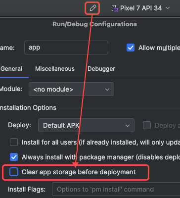
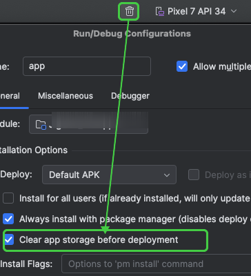

# Clear App Storage Before Deploy

Android Studio plugin that adds a toggle button to the main toolbar for quickly enabling/disabling the "Clear app storage before deployment" option.

## What it does

Instead of navigating to **Run/Debug Configurations > General > Clear app storage before deployment** every time, just click the toggle button on the toolbar.

The plugin directly controls Android Studio's built-in setting — no custom adb commands, no extra configuration.

| Toggle OFF | Toggle ON |
|:---:|:---:|
|  |  |

## Installation

### From JetBrains Marketplace
1. Open **Settings > Plugins > Marketplace**
2. Search for "Clear App Storage Before Deploy"
3. Click **Install** and restart Android Studio

### From disk
1. Download the latest release `.zip`
2. Open **Settings > Plugins > ⚙️ > Install Plugin from Disk...**
3. Select the `.zip` file and restart Android Studio

## Usage

1. The toggle button appears in the right side of the main toolbar
2. Click to enable/disable clearing app storage before deployment
3. The icon changes to indicate the current state
4. Run your app — Android Studio will clear storage automatically when enabled

## Compatibility

- Android Studio Hedgehog (2023.1) and later
- Supports both new UI and classic UI

## Building from source

```bash
./gradlew buildPlugin
```

The plugin zip will be in `build/distributions/`.

## License

[Apache License 2.0](LICENSE)
